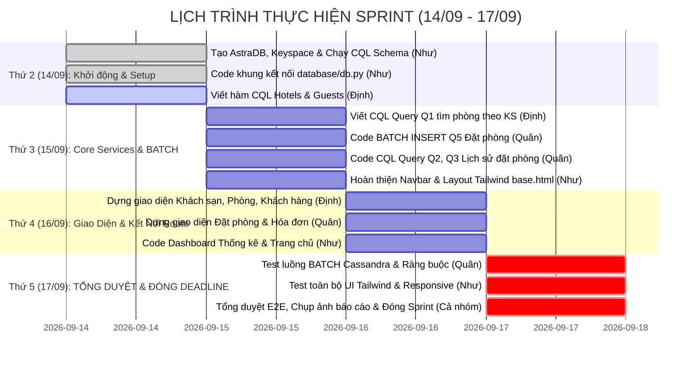

# 📋 KẾ HOẠCH QUẢN LÝ DỰ ÁN TRÊN JIRA (JIRA SPRINT BACKLOG)
## 🏨 Đồ Án: Hệ Thống Quản Lý Khách Sạn NoSQL (Cassandra / AstraDB)

> **Mục tiêu & Hạn chót (Hard Deadline):** **24h00 Thứ Năm (17/09/2026)** — Toàn bộ chức năng, kiểm thử, chụp ảnh demo và đóng gói mã nguồn phải hoàn tất trước 24h00 Thứ Năm để sáng Thứ Sáu (18/09) sẵn sàng nộp bài / thuyết trình.  
> **Phương pháp:** Agile / Scrum - Sprint 4 ngày.  
> **Đội ngũ (3 thành viên):**  
> - 👤 **Như** (Hạ tầng Database AstraDB, Layout Tailwind & Dashboard)  
> - 👤 **Định** (Catalog: Khách sạn, Phòng, Khách hàng)  
> - 👤 **Quân** (Transactions: Đặt phòng BATCH Q5, Hóa đơn Q4)

---

## 📅 TIMELINE TIẾN ĐỘ THEO NGÀY (DEADLINE: THỨ NĂM)

---

## 🎯 DANH SÁCH EPIC TRÊN JIRA

1. **`EPIC-1`**: Hạ tầng Cloud Database & Kiến trúc ứng dụng *(Owner: Như)*
2. **`EPIC-2`**: Quản lý Thông tin Khách sạn, Phòng & Khách hàng *(Owner: Định)*
3. **`EPIC-3`**: Nghiệp vụ Đặt phòng, Ghi đồng thời BATCH & Hóa đơn *(Owner: Quân)*
4. **`EPIC-4`**: Giao diện Tailwind CSS, Báo cáo Dashboard & Tích hợp hoàn thiện *(Owner: Cả nhóm)*

---

## 📝 CHI TIẾT TỪNG USER STORY / TASK (CÓ THỂ IMPORT THẲNG VÀO JIRA)

### 🔹 EPIC 1: HẠ TẦNG & DATABASE (Phụ trách: NHƯ)

| Ticket ID | Tên công việc (Summary) | Assignee | Story Points | Ưu tiên | Hạn chót | Mô tả & Tiêu chuẩn chấp nhận (Acceptance Criteria) |
| :--- | :--- | :--- | :---: | :---: | :---: | :--- |
| **`QLKS-01`** | Tạo Keyspace `hotel_ks` và import bảng DDL | **Như** | 3 SP | 🔴 High | **Thứ 2 (14/09)** | **Mô tả:** Đăng ký AstraDB, tạo keyspace `hotel_ks`. Chạy toàn bộ file `cql/schema.cql` trên CQL Console. **AC:** 6 bảng được tạo thành công, insert được 2 dòng dữ liệu mẫu để test. |
| **`QLKS-02`** | Viết module kết nối `database/db.py` | **Như** | 3 SP | 🔴 High | **Thứ 2 (14/09)** | **Mô tả:** Tải secure bundle zip, tạo Astra Token. Hoàn thiện hàm `get_session()` kết nối thành công. **AC:** Chạy lệnh test in ra thông báo `Kết nối AstraDB thành công!`. |
| **`QLKS-03`** | Chuẩn hóa khung giao diện `base.html` với Tailwind v4 | **Như** | 2 SP | 🟡 Med | **Thứ 3 (15/09)** | **Mô tả:** Cấu hình Tailwind CSS v4 CDN, Google Font Inter, Navbar có highlight phân màu cho 3 bạn, menu responsive trên mobile. **AC:** Mọi trang con kế thừa đều có navbar và footer chuẩn. |

---

### 🔹 EPIC 2: KHÁCH SẠN, PHÒNG & KHÁCH HÀNG (Phụ trách: ĐỊNH)

| Ticket ID | Tên công việc (Summary) | Assignee | Story Points | Ưu tiên | Hạn chót | Mô tả & Tiêu chuẩn chấp nhận (Acceptance Criteria) |
| :--- | :--- | :--- | :---: | :---: | :---: | :--- |
| **`QLKS-04`** | Viết Service CQL cho `hotels` và `guests` | **Định** | 3 SP | 🔴 High | **Thứ 3 (15/09)** | **Mô tả:** Viết hàm `get_all_hotels`, `create_hotel`, `get_all_guests`, `create_guest` trong `services/hotel_service.py`. **AC:** Thêm và lấy dữ liệu thành công từ bảng `hotels` và `guests`. |
| **`QLKS-05`** | Viết Service CQL Query Q1 (`rooms_by_hotel`) | **Định** | 3 SP | 🔴 High | **Thứ 3 (15/09)** | **Mô tả:** Viết hàm `get_rooms_by_hotel(hotel_id)` và `create_room(...)` theo Partition Key `hotel_id`. **AC:** Lấy đúng danh sách phòng của khách sạn chỉ định mà không quét toàn bảng. |
| **`QLKS-06`** | Dựng Route & Giao diện Khách sạn (`hotels.html`, `guests.html`) | **Định** | 3 SP | 🟡 Med | **Thứ 4 (16/09)** | **Mô tả:** Hoàn thiện route Flask và form thêm/bảng danh sách đẹp mắt với Tailwind CSS. **AC:** Người dùng thêm được khách sạn và khách hàng mới trực tiếp trên web. |
| **`QLKS-07`** | Dựng Route & Giao diện Quản lý Phòng (`rooms.html`) | **Định** | 2 SP | 🟡 Med | **Thứ 4 (16/09)** | **Mô tả:** Hoàn thiện trang danh sách phòng theo từng khách sạn kèm form thêm phòng mới. **AC:** Bấm vào nút "Xem phòng" từ khách sạn sẽ nhảy sang đúng danh sách phòng của khách sạn đó. |

---

### 🔹 EPIC 3: NGHIỆP VỤ ĐẶT PHÒNG & HÓA ĐƠN (Phụ trách: QUÂN)

| Ticket ID | Tên công việc (Summary) | Assignee | Story Points | Ưu tiên | Hạn chót | Mô tả & Tiêu chuẩn chấp nhận (Acceptance Criteria) |
| :--- | :--- | :--- | :---: | :---: | :---: | :--- |
| **`QLKS-08`** | Cài đặt logic BATCH INSERT Đặt phòng (Query Q5) | **Quân** | 5 SP | 🔴 Blocker | **Thứ 3 (15/09)** | **Mô tả (Trọng tâm đồ án):** Viết hàm `create_booking_batch` trong `services/booking_service.py` dùng `BEGIN BATCH ... APPLY BATCH;` ghi đồng thời vào cả 2 bảng `bookings_by_guest` và `bookings_by_hotel_date`. **AC:** Cả 2 bảng đều có bản ghi sau 1 thao tác đặt phòng, đảm bảo tính nhất quán dữ liệu phân tán. |
| **`QLKS-09`** | Cài đặt truy vấn tra cứu lịch sử Q2 & Q3 | **Quân** | 3 SP | 🔴 High | **Thứ 3 (15/09)** | **Mô tả:** Viết hàm `get_bookings_by_guest(guest_id)` (Q2) và `get_bookings_by_hotel_date(hotel_id, date)` (Q3). **AC:** Tra cứu nhanh chóng theo Partition Key tương ứng của từng bảng. |
| **`QLKS-10`** | Cài đặt truy vấn Hóa đơn thanh toán (Query Q4) | **Quân** | 2 SP | 🟡 Med | **Thứ 4 (16/09)** | **Mô tả:** Viết hàm `get_invoice_by_booking(booking_id)` và `create_invoice(...)` lấy từ bảng `invoices_by_booking`. **AC:** Hiển thị hóa đơn chuẩn với mã đặt phòng tương ứng. |
| **`QLKS-11`** | Dựng Route & Giao diện Đặt phòng + Hóa đơn (`bookings.html`, `invoices.html`) | **Quân** | 3 SP | 🟡 Med | **Thứ 4 (16/09)** | **Mô tả:** Dựng form tạo booking mới, bộ lọc tìm kiếm theo khách hàng hoặc ngày check-in, và giao diện phiếu hóa đơn Tailwind CSS. **AC:** Hoàn tất trọn vẹn luồng Đặt phòng ➡️ Xem hóa đơn trên UI. |

---

### 🔹 EPIC 4: DASHBOARD, KIỂM THỬ TỔNG HỢP & HOÀN TẤT (Phụ trách: CẢ NHÓM)

| Ticket ID | Tên công việc (Summary) | Assignee | Story Points | Ưu tiên | Hạn chót | Mô tả & Tiêu chuẩn chấp nhận (Acceptance Criteria) |
| :--- | :--- | :--- | :---: | :---: | :---: | :--- |
| **`QLKS-12`** | Xây dựng Dashboard thống kê & Trang chủ | **Như** | 3 SP | 🟡 Med | **Thứ 4 (16/09)** | **Mô tả:** Hoàn thiện `services/dashboard_service.py`, `dashboard.html` và `index.html` (các thẻ card chỉ số tổng quan, biểu đồ). **AC:** Hiển thị tổng số khách sạn, số phòng, số lượt đặt phòng. |
| **`QLKS-13`** | Kiểm thử luồng tích hợp End-to-End (E2E Integration) | **Quân + Định + Như** | 3 SP | 🔴 High | **Thứ 5 (17/09)** | **Mô tả:** Cả 3 người cùng test chéo: Tạo khách sạn ➡️ Tạo phòng ➡️ Tạo khách ➡️ Đặt phòng BATCH ➡️ Kiểm tra xuất hiện ở cả 2 bảng ➡️ Xem hóa đơn. **AC:** Không xảy ra lỗi 500 hay crash ứng dụng. |
| **`QLKS-14`** | Bắt lỗi ngoại lệ (Error Handling) & Tinh chỉnh UI Tailwind | **Như + Quân** | 2 SP | 🟡 Med | **Thứ 5 (17/09)** | **Mô tả:** Thêm thông báo flash thông báo khi thêm/sửa thành công hoặc lỗi, căn chỉnh giao diện sạch đẹp, không vỡ layout. **AC:** Giao diện trực quan, dễ thao tác demo trước giảng viên. |
| **`QLKS-15`** | Chụp màn hình demo, chuẩn bị slide/báo cáo & Đóng Sprint | **Cả nhóm** | 1 SP | 🟢 Low | **Thứ 5 (17/09)** | **Mô tả:** Chụp ảnh minh họa các truy vấn Q1-Q5 trên web và trên AstraDB CQL Console, commit toàn bộ code lên Git. **AC:** Mã nguồn sạch sẽ, sẵn sàng nộp và thuyết trình vào Thứ Sáu. |

---

## 📊 TỔNG HỢP STORY POINTS THEO THÀNH VIÊN

| Thành viên | Nhiệm vụ chính | Tổng Story Points | Trọng số công việc |
| :--- | :--- | :---: | :---: |
| 👤 **Định** | Catalog (Khách sạn, Phòng Q1, Khách hàng) | **11 SP** | ~31% |
| 👤 **Quân** | Transactions (Đặt phòng BATCH Q5, Lịch sử Q2/Q3, Hóa đơn Q4) | **13 SP** | ~36% |
| 👤 **Như** | Infrastructure (AstraDB, db.py, Base Tailwind, Dashboard) | **11 SP** | ~31% |
| 👥 **Chung (Cả 3)** | Kiểm thử tổng thể, Chụp ảnh báo cáo & Đóng gói | **2 SP** | ~2% |
| **TỔNG CỘNG** | **Toàn bộ Sprint (Hoàn thành trong 4 ngày)** | **37 SP** | **100%** |

---

## 🏁 ĐIỀU KIỆN HOÀN THÀNH SPRINT (DEFINITION OF DONE - DoD)
- [ ] Mọi code được push lên đúng branch hoặc merge vào `main` không bị xung đột (conflict).
- [ ] Thực hiện đủ **5 Query bắt buộc theo đề cương PDF**:
  - `Q1`: Tìm danh sách phòng theo khách sạn (`rooms_by_hotel`)
  - `Q2`: Lịch sử đặt phòng theo khách hàng (`bookings_by_guest`)
  - `Q3`: Lịch sử đặt phòng theo khách sạn và ngày check-in (`bookings_by_hotel_date`)
  - `Q4`: Tra cứu chi tiết hóa đơn (`invoices_by_booking`)
  - `Q5`: Ghi đồng thời BATCH STATEMENT cho việc đặt phòng.
- [ ] Giao diện Tailwind CSS hiển thị rõ ràng, mượt mà trên trình duyệt.
- [ ] Toàn bộ hệ thống được test hoàn tất và **chốt sổ chậm nhất vào đúng 24h00 Thứ Năm (17/09/2026)**.
