# Tóm tắt task và phân tích mã nguồn hệ thống Quản lý Khách sạn NoSQL

## 1. Phạm vi đọc mã

Repository không có thư mục `src/`. Vì vậy, báo cáo này xem toàn bộ phần triển khai sau là mã nguồn của ứng dụng:

- `app.py`
- `routes/`
- `services/`
- `database/`
- `cql/schema.cql`
- `templates/`
- `static/css/` và `static/js/`
- `tests/`
- `requirements.txt` và `.env.example` để đối chiếu cấu hình chạy

File PDF trong `docs/` và các file README không được xem là mã thực thi nên không nằm trong phạm vi phân tích chi tiết.

## 2. Tóm tắt tổng quan

Đây là một ứng dụng web quản lý khách sạn được xây dựng bằng Flask, Jinja2 và Apache Cassandra/DataStax Astra DB. Dự án áp dụng cách thiết kế dữ liệu theo truy vấn (query-first) và phi chuẩn hóa dữ liệu đặt phòng thành nhiều bảng để phục vụ từng kiểu tra cứu.

Kiến trúc hiện tại chia thành ba lớp chính:

1. `routes`: nhận HTTP request và render giao diện.
2. `services`: dự kiến chứa nghiệp vụ và truy vấn Cassandra.
3. `database`: tạo và cache kết nối tới Astra DB.

Phần giao diện dùng Jinja2, Tailwind CSS từ CDN, Bootstrap Icons và Chart.js. Cấu trúc tổng thể khá rõ ràng cho một đồ án nhóm. Sau QLKS-04 và QLKS-05, tầng service đã có thể thêm và đọc khách sạn, khách hàng và phòng. QLKS-06 đã nối service khách sạn/khách hàng vào route và hoàn thiện hai giao diện tương ứng. Phần giao diện phòng, đặt phòng và hóa đơn vẫn chủ yếu dừng ở khung sườn.

## Task 4: service khách sạn và khách hàng

### Yêu cầu

Triển khai bốn hàm trong `services/hotel_service.py`:

- `get_all_hotels()`
- `create_hotel()`
- `get_all_guests()`
- `create_guest()`

Acceptance Criteria: thêm và lấy dữ liệu thành công từ hai bảng Cassandra `hotels` và `guests`.

### Tư duy query-first đã áp dụng

Trước khi viết hàm, bốn access pattern được xác định rõ:

```sql
SELECT hotel_id, name, phone, address, city, country, amenities
FROM hotels;

INSERT INTO hotels (
    hotel_id, name, phone, address, city, country, amenities
) VALUES (?, ?, ?, ?, ?, ?, ?);

SELECT guest_id, full_name, email, phone, id_card
FROM guests;

INSERT INTO guests (
    guest_id, full_name, email, phone, id_card
) VALUES (?, ?, ?, ?, ?);
```

Schema hiện có dùng `hotel_id` và `guest_id` làm partition key. Thiết kế này tốt cho thao tác ghi và tra cứu theo ID. Hai truy vấn `get_all_*` là quét toàn bảng, chỉ phù hợp với dữ liệu nhỏ của đồ án. Nếu hệ thống lớn hơn, cần tạo bảng chuyên phục vụ access pattern liệt kê thay vì dựa vào full table scan.

### Nội dung đã triển khai

| Hàm | Cách xử lý | Giá trị trả về |
|---|---|---|
| `get_all_hotels` | Thực thi `SELECT` với danh sách cột tường minh | `list` Cassandra Row; lỗi trả `[]` |
| `create_hotel` | Prepared `INSERT`; chuẩn hóa tiện nghi | Thành công `True`, lỗi `False` |
| `get_all_guests` | Thực thi `SELECT` với danh sách cột tường minh | `list` Cassandra Row; lỗi trả `[]` |
| `create_guest` | Prepared `INSERT` | Thành công `True`, lỗi `False` |

Các điểm cần ghi nhớ:

- Prepared statement của `cassandra-driver` dùng placeholder `?`.
- Cassandra không có auto-increment; caller phải cung cấp `hotel_id` và `guest_id`.
- `amenities` trong schema là `set<text>`, vì vậy service chuyển chuỗi phân tách bằng dấu phẩy hoặc iterable thành Python `set`.
- Các hàm bắt lỗi từ driver để không làm route văng lỗi 500 trực tiếp.
- Thông báo lỗi dùng chuỗi ASCII để không phát sinh `UnicodeEncodeError` trên Windows console CP1252.
- Các hàm đọc giữ nguyên Cassandra Row; Jinja có thể truy cập dạng `hotel.name` hoặc `guest.full_name`.

### Kiểm thử

Đã thêm `tests/test_hotel_service.py` với sáu ca kiểm thử:

1. Đọc danh sách khách sạn.
2. Thêm khách sạn bằng prepared statement và kiểm tra `amenities` là `set`.
3. Đọc danh sách khách hàng.
4. Thêm khách hàng bằng prepared statement và kiểm tra thứ tự tham số.
5. Trả giá trị an toàn khi không có kết nối database.
6. Trả giá trị an toàn khi Cassandra driver ném exception.

Kết quả: `Ran 6 tests ... OK`. Kiểm tra cú pháp bằng `py_compile` cũng thành công.

Đã bổ sung `tests/test_hotel_service_integration.py` để xác nhận trực tiếp AC trên Cassandra/Astra DB. Bài test sử dụng hai ID cố định `H_QLKS04_TEST` và `G_QLKS04_TEST`, thực hiện `INSERT` qua service rồi gọi hàm `get_all_*` để xác nhận đọc lại được đúng bản ghi. ID cố định làm cho test có thể chạy lại mà không tạo thêm hàng trùng vì Cassandra thực hiện upsert theo primary key.

File `.env` cục bộ đã được cấu hình để kết nối keyspace `hotel_ks`. `.gitignore` loại trừ `.env` và `*.zip`, nên token và Secure Connect Bundle không nằm trong commit.

Khi chạy trên Python 3.12, `cassandra-driver==3.29.2` cần module tương thích `asyncore`; do đó `requirements.txt` đã bổ sung `pyasyncore==1.0.5` có điều kiện cho Python 3.12 trở lên.

Kết quả kiểm thử cuối cùng: cả 6 unit test và 2 integration test đều đạt (`Ran 8 tests ... OK`). Hai integration test đã kết nối Astra DB thật, insert rồi đọc lại thành công `H_QLKS04_TEST` trong bảng `hotels` và `G_QLKS04_TEST` trong bảng `guests`. QLKS-04 đã đáp ứng đầy đủ Acceptance Criteria và có thể chuyển sang trạng thái **Done**.

## Task 5: service phòng theo khách sạn

### Yêu cầu

Triển khai `get_rooms_by_hotel(hotel_id)` và `create_room(...)` trong `services/hotel_service.py` theo partition key `hotel_id`.

Acceptance Criteria: lấy đúng danh sách phòng của khách sạn chỉ định mà không quét toàn bộ bảng `rooms_by_hotel`.

### Access pattern và thiết kế Cassandra

Query Q1 được viết trước khi triển khai hàm:

```sql
SELECT hotel_id, room_number, room_type, price_per_night, is_available
FROM rooms_by_hotel
WHERE hotel_id = ?;
```

Primary key của bảng là `(hotel_id, room_number)`, trong đó `hotel_id` là partition key và `room_number` là clustering column. Vì query cung cấp đầy đủ partition key nên Cassandra định tuyến thẳng tới partition của khách sạn cần đọc, không cần `ALLOW FILTERING` và không quét toàn bảng.

### Nội dung đã triển khai

- `get_rooms_by_hotel` dùng prepared statement với `WHERE hotel_id = ?`, thực thi bằng tuple một phần tử `(hotel_id,)` và trả danh sách Cassandra Row.
- `create_room` dùng prepared `INSERT` với đủ năm cột của bảng.
- `price_per_night` được chuẩn hóa thành `Decimal` để khớp kiểu `decimal` của Cassandra.
- `is_available` được chuẩn hóa thành `boolean`; các chuỗi `1`, `true`, `yes`, `on` được hiểu là `True`, còn chuỗi khác là `False`.
- Khi không có session hoặc driver ném exception, hàm đọc trả `[]` và hàm ghi trả `False`.

### Kiểm thử QLKS-05

`tests/test_room_service.py` có bốn unit test, kiểm tra:

1. CQL chứa `FROM rooms_by_hotel` và `WHERE hotel_id = ?`.
2. Giá trị bind đúng `(hotel_id,)` cho query đọc.
3. Prepared insert nhận đúng `Decimal` và `boolean`.
4. Giá trị trả về an toàn khi mất kết nối hoặc Cassandra báo lỗi.

`tests/test_room_service_integration.py` kiểm tra trực tiếp trên Astra DB bằng hai partition `H_QLKS05_TEST_A` và `H_QLKS05_TEST_B`. Test tạo `A501`, `A502` cho khách sạn A và `B901` cho khách sạn B, sau đó truy vấn khách sạn A và xác nhận:

- Kết quả có `A501`, `A502`.
- Mọi Cassandra Row đều có `hotel_id == H_QLKS05_TEST_A`.
- Kết quả không chứa `B901` thuộc partition khách sạn B.

Kết quả cuối: 4 unit test QLKS-05 và 1 integration test Astra đều đạt. Toàn bộ test suite của dự án hiện có 13 test và tất cả đều `OK`. QLKS-05 đáp ứng đầy đủ Acceptance Criteria và có thể chuyển sang trạng thái **Done**.

## Task 6: route và giao diện khách sạn/khách hàng

### Yêu cầu

Hoàn thiện route Flask và form thêm/bảng danh sách trong `hotels.html`, `guests.html` bằng Tailwind CSS.

Acceptance Criteria: người dùng thêm được khách sạn và khách hàng mới trực tiếp trên web.

### Route đã triển khai

- `GET /hotels` và `GET /guests` lấy Cassandra Row từ service rồi truyền cho template cùng trạng thái form rỗng.
- `POST /hotels/add` đọc sáu trường, kiểm tra năm trường bắt buộc, tự sinh `hotel_id` dạng `H` + 8 ký tự hex và gọi `create_hotel`.
- `POST /guests/add` đọc bốn trường, kiểm tra trường bắt buộc/định dạng email, tự sinh `guest_id` dạng `G` + 8 ký tự hex và gọi `create_guest`.
- Thành công dùng POST/Redirect/GET và flash message; validation lỗi trả HTTP 400, giữ dữ liệu đã nhập; lỗi ghi database trả HTTP 503 cùng hướng xử lý rõ ràng.

### Giao diện đã triển khai

- Hai trang dùng bố cục mobile-first: form và bảng xếp dọc trên màn hình nhỏ, chia hai cột trên desktop.
- Form có label liên kết với input, required marker, semantic input type, autocomplete, input mode và lỗi ngay dưới trường.
- Nút chính và nút thao tác có vùng bấm tối thiểu 44px, focus ring bàn phím, hover state và `motion-reduce`.
- Khi submit, nút chuyển sang trạng thái “Đang thêm…” và bị vô hiệu hóa để tránh ghi trùng trong lúc chờ Astra DB.
- Bảng được bọc `overflow-x-auto`, có empty state và hành động quay lại form.
- Danh sách khách sạn hiển thị tiện nghi và nút “Xem phòng”; danh sách khách hàng có liên kết email/điện thoại và nút “Lịch sử”.
- `base.html` có vùng flash message `aria-live`, icon kèm nội dung để không phụ thuộc màu, skip link và trạng thái `aria-expanded` cho menu mobile.

### Kiểm thử QLKS-06

`tests/test_hotel_routes.py` có bảy test kiểm tra render dữ liệu, gọi service đúng tham số, ID sinh tự động, redirect/flash, validation và lỗi database.

`tests/test_hotel_routes_integration.py` có hai test gửi HTTP POST thật qua Flask test client rồi truy vấn Astra để xác nhận dữ liệu. Test đã tạo/upsert:

- Khách sạn `H06060606` — `QLKS-06 Web Test Hotel`.
- Khách hàng `G07070707` — `QLKS-06 Web Test Guest`.

Cả 7 route test và 2 integration test đều đạt. Toàn bộ test suite sau QLKS-06 có 22 test và tất cả đều `OK`. QLKS-06 đáp ứng đầy đủ Acceptance Criteria và có thể chuyển sang trạng thái **Done**.

---

## Task Nâng Cấp Hoàn Thiện: Toàn Bộ Luồng Hoạt Động Của Định (Cập nhật ngày 17/09/2026)

### 1. Phân định trách nhiệm trên Jira (Jira Sprint Backlog)
- **Định phụ trách chính (9 Story Points)**:
  - `QLKS-04`: Viết Service CQL cho `hotels` và `guests` (`services/hotel_service.py`).
  - `QLKS-05`: Viết Service CQL Query Q1 tìm phòng theo khách sạn (`services/room_service.py`).
  - `QLKS-06`: Dựng Route & Giao diện Khách sạn & Khách hàng (`routes/hotel_routes.py`, `templates/hotels.html`, `templates/guests.html`).
  - Module nạp & chuẩn hóa 34 tỉnh thành và phường/xã (`services/location_service.py`, `docs/provinces.json`).
- **Phần của bạn Như**: `QLKS-01` (AstraDB DDL), `QLKS-02` (db.py), `QLKS-03` (base.html), `QLKS-07` (Quản lý Phòng `rooms.html`), `QLKS-12` (Dashboard) — *Định và AI không can thiệp*.
- **Phần của bạn Quân**: `QLKS-08` (BATCH INSERT Q5), `QLKS-09` (Tra cứu Q2/Q3), `QLKS-10` (Hóa đơn Q4), `QLKS-11` (Giao diện Đặt phòng/Hóa đơn) — *Định và AI không can thiệp*.

---

### 2. Sơ Đồ Tổng Quan Luồng Hoạt Động (Architecture Flow)

```mermaid
flowchart TD
    subgraph UI["🌐 Giao Diện Người Dùng (templates)"]
        H_List["Click 'Khách sạn' trên Navbar"]
        H_Add["Submit Form '+ Thêm khách sạn mới'"]
        H_Edit["Click nút '[Sửa]' trên dòng KS"]
        H_Del["Click nút '[Xóa]' trên dòng KS"]
        G_List["Click 'Khách hàng' trên Navbar"]
        G_Add["Submit Form '+ Thêm khách hàng mới'"]
        G_Edit["Click nút '[Sửa]' trên dòng Khách"]
        G_Del["Click nút '[Xóa]' trên dòng Khách"]
    end

    subgraph ROUTE["🛣️ Tầng Điều Hướng (routes/hotel_routes.py)"]
        R_H_List["GET /hotels\nlist_hotels()"]
        R_H_Add["POST /hotels/add\nadd_hotel()"]
        R_H_Edit["POST /hotels/<id>/edit\nedit_hotel()"]
        R_H_Del["POST /hotels/<id>/delete\ndelete_hotel()"]
        R_G_List["GET /guests\nlist_guests()"]
        R_G_Add["POST /guests/add\nadd_guest()"]
        R_G_Edit["POST /guests/<id>/edit\nedit_guest()"]
        R_G_Del["POST /guests/<id>/delete\ndelete_guest()"]
        R_Prov["GET /api/provinces/<code_tinh>/wards\nget_wards_api()"]
    end

    subgraph SERVICE["⚙️ Tầng Dịch Vụ (services)"]
        S_H_Get["hotel_service.get_all_hotels()"]
        S_H_Cre["hotel_service.create_hotel(...)"]
        S_H_Upd["hotel_service.update_hotel(...)"]
        S_H_Del["hotel_service.delete_hotel(...)"]
        S_G_Get["hotel_service.get_all_guests()"]
        S_G_Cre["hotel_service.create_guest(...)"]
        S_G_Upd["hotel_service.update_guest(...)"]
        S_G_Del["hotel_service.delete_guest(...)"]
        S_Loc["location_service.get_wards_by_province(...)"]
    end

    subgraph DB["🗄️ Cơ Sở Dữ Liệu Cassandra / AstraDB"]
        CQL_H_Sel["SELECT * FROM hotels;"]
        CQL_H_Ins["INSERT INTO hotels (...) VALUES (...);"]
        CQL_H_Upd["UPDATE hotels SET ... WHERE hotel_id = ?;"]
        CQL_H_Del["DELETE FROM rooms_by_hotel WHERE hotel_id = ?;\nDELETE FROM hotels WHERE hotel_id = ?;"]
        CQL_G_Sel["SELECT * FROM guests;"]
        CQL_G_Ins["INSERT INTO guests (...) VALUES (...);"]
        CQL_G_Upd["UPDATE guests SET ... WHERE guest_id = ?;"]
        CQL_G_Del["DELETE FROM guests WHERE guest_id = ?;"]
    end

    H_List --> R_H_List --> S_H_Get --> CQL_H_Sel
    H_Add --> R_H_Add --> S_H_Cre --> CQL_H_Ins
    H_Edit --> R_H_Edit --> S_H_Upd --> CQL_H_Upd
    H_Del --> R_H_Del --> S_H_Del --> CQL_H_Del
    G_List --> R_G_List --> S_G_Get --> CQL_G_Sel
    G_Add --> R_G_Add --> S_G_Cre --> CQL_G_Ins
    G_Edit --> R_G_Edit --> S_G_Upd --> CQL_G_Upd
    G_Del --> R_G_Del --> S_G_Del --> CQL_G_Del
```



---

### 3. Chi Tiết Từng Luồng Nghiệp Vụ Khi Thao Tác (Action Step-by-Step)

#### 📍 Luồng 1: Xem danh sách Khách sạn (`GET /hotels`)
1. **Thao tác**: Người dùng bấm **"Khách sạn"** trên thanh điều hướng Navbar.
2. **Route tiếp nhận**: `GET /hotels` chạy hàm `list_hotels()` trong `routes/hotel_routes.py`.
3. **Truy vấn dữ liệu**:
   - `hotel_service.get_all_hotels()`: Thực thi `SELECT hotel_id, name, phone, address, city, country, amenities FROM hotels;`.
   - `location_service.get_all_provinces()`: Lấy danh sách 34 tỉnh thành đã chuẩn hóa tên gọn gàng (`clean_name`).
4. **Render giao diện**: [hotels.html](file:///c:/Users/Admin/Documents/Taiieu/nosql/QLKS-NoSQL/templates/hotels.html) hiển thị:
   - **Thẻ KPI Thống kê**: Tổng khách sạn, số tỉnh thành có cơ sở.
   - **Thanh tìm kiếm & lọc**: Tìm kiếm realtime theo tên, SĐT, địa chỉ hoặc lọc theo tỉnh thành mà không reload trang.
   - **Bảng Full-Width**: Rộng rãi 100%, khắc phục hoàn toàn tình trạng bảng bị bóp hẹp gây thanh cuộn ngang ở phiên bản cũ. Các nút "Phòng", "Sửa", "Xóa" hiển thị rõ ràng.

#### 📍 Luồng 2: Thêm mới Khách sạn (`POST /hotels/add`)
1. **Thao tác**: Người dùng bấm nút **"+ Thêm khách sạn mới"** ➡️ Modal Dialog mở ra.
2. **Điền biểu mẫu**:
   - **Tên khách sạn**: Ô nhập tự do, không còn dropdown gợi ý cứng (bỏ datalist ngoài DB). **Chặn trùng lặp**: Nếu tên khách sạn đã tồn tại trong DB, hệ thống lập tức báo lỗi đỏ: *"Tên khách sạn đã tồn tại trong hệ thống."*.
   - **Số điện thoại**: Ràng buộc đúng 10 chữ số, bắt đầu bằng `0` (Frontend: `pattern="0[0-9]{9}"`, Backend: `is_valid_phone()`).
   - **Tỉnh / Thành phố**: Lấy từ `provinces.json`, đã bỏ hậu tố rườm rà `(Thành phố Trung Ương)` và `(Tỉnh)`, hiển thị tên ngắn gọn: `Hà Nội`, `Hồ Chí Minh`, `Đà Nẵng`, `Cao Bằng`...
   - **Xã / Phường**: Tự động gọi API `GET /api/provinces/<pCode>/wards` nạp danh sách xã/phường tương ứng. Tên xã được đưa lên đầu (`Dầu Tiếng (Xã)`, `Bến Cát (Phường)`). Hỗ trợ phím gõ nhanh thông minh: gõ chữ cái đầu ("D", "B", "M"...) là nhảy ngay đến xã/phường cần chọn.
   - **Địa chỉ chi tiết**: Số nhà, tên đường. Khi lưu, hệ thống tự động ghép với Xã/Phường: `address = f"{raw_address}, {ward}"`.
   - **Tiện nghi**: Tích chọn trực quan từ 12 checkbox pills có icon sinh động + ô nhập tiện nghi tùy chỉnh.
   - **Quốc gia**: Đã bỏ trên UI, backend tự động gán mặc định `'Vietnam'`.
3. **Xử lý Backend & Cassandra**:
   - Nhấn **"Thêm khách sạn"** ➡️ Gửi `POST /hotels/add`.
   - Kiểm tra validation: Nếu lỗi hoặc trùng tên, giữ nguyên modal và hiển thị thông báo đỏ dưới từng ô nhập.
   - Tự động sinh mã khách sạn duy nhất: `hotel_id = f'H{uuid4().hex[:8].upper()}'` (Chuẩn 9 ký tự, ví dụ: `H3F8A1B2`).
   - Gọi `hotel_service.create_hotel(...)`: Chuẩn hóa `amenities` thành `set<text>` và chạy prepared statement `INSERT INTO hotels (...) VALUES (?, ?, ?, ?, ?, ?, ?);`.
   - Flash thông báo thành công và redirect về `GET /hotels`.

#### 📍 Luồng 3: Chỉnh sửa Khách sạn (`POST /hotels/<hotel_id>/edit`)
1. **Thao tác**: Bấm nút **"[Sửa]"** trên dòng khách sạn ➡️ Modal Edit mở ra với đầy đủ thông tin hiện tại.
2. `hotel_id` được giữ nguyên cố định (Partition Key trong Cassandra không thể thay đổi).
3. Người dùng cập nhật tên, số điện thoại, chọn lại Tỉnh ➡️ tự nạp lại Xã/Phường, tích chọn lại tiện nghi.
4. Bấm **"Lưu thay đổi"** ➡️ Gửi `POST /hotels/<hotel_id>/edit`:
   - Kiểm tra tên khách sạn mới không được trùng với các khách sạn khác đang có.
   - Gọi `hotel_service.update_hotel(hotel_id, name, phone, address, city, country, amenities)`.
   - Cassandra thực thi câu lệnh prepared: `UPDATE hotels SET name = ?, phone = ?, address = ?, city = ?, country = ?, amenities = ? WHERE hotel_id = ?;`.
   - Flash thông báo thành công và cập nhật lại bảng danh sách.

#### 📍 Luồng 4: Xóa Khách sạn (`POST /hotels/<hotel_id>/delete`)
1. **Thao tác**: Bấm nút **"[Xóa]"** màu đỏ ➡️ Modal xác nhận mở ra hiển thị tên khách sạn cần xóa.
2. **Xử lý Backend**:
   - Gửi `POST /hotels/<hotel_id>/delete`.
   - Hàm `hotel_service.delete_hotel(hotel_id)` tự động xóa sạch các phòng thuộc partition khách sạn đó trước: `DELETE FROM rooms_by_hotel WHERE hotel_id = ?;`.
   - Sau đó xóa bản ghi trong bảng `hotels`: `DELETE FROM hotels WHERE hotel_id = ?;`.
   - Redirect về trang danh sách kèm flash thông báo.

#### 📍 Luồng 5: Quản lý Khách hàng (`GET /guests`, Full CRUD)
- **Xem danh sách**: `GET /guests` ➡️ `hotel_service.get_all_guests()`.
- **Ràng buộc định dạng CCCD / Hộ chiếu**: Loại bỏ CMND cũ (9 số). Chỉ chấp nhận **CCCD** gồm đúng 12 chữ số (`^\d{12}$`) hoặc **Hộ chiếu** gồm 1 chữ cái và 7-8 số (`^[A-Za-z]\d{7,8}$`, ví dụ: `B1234567`).
- **Chặn trùng lặp đa trường**:
  - Không cho phép trùng **Số CCCD / Hộ chiếu** (`id_card`) giữa các khách hàng (chuẩn hóa chữ hoa không phân biệt hoa thường).
  - Không cho phép trùng **Email** (`email`) giữa các khách hàng.
  - Không cho phép trùng **Số điện thoại** (`phone`) giữa các khách hàng.
- **Thêm mới**: `POST /guests/add` ➡️ Modal thêm khách, ràng buộc SĐT 10 số (bắt đầu bằng 0), CCCD 12 số / Hộ chiếu, kiểm tra trùng lặp, chọn tỉnh/xã động, tự sinh mã `G{uuid4().hex[:8].upper()}`.
- **Hỗ trợ trường Địa chỉ cư trú (`address`)**: Tự động fallback an toàn nếu AstraDB chưa chạy migration `ALTER TABLE guests ADD address text;`.
- **Sửa & Xóa**: `POST /guests/<guest_id>/edit` và `POST /guests/<guest_id>/delete` qua Modal xác nhận (cũng kiểm tra chặn trùng với khách hàng khác khi sửa).

#### 📍 Luồng 6: Quản lý Phòng (`GET /hotels/<hotel_id>/rooms`)
- Tự động lấy tên khách sạn thực tế từ cơ sở dữ liệu (`hotel_service.get_hotel_by_id(hotel_id)`).
- Tích hợp bộ chuyển đổi khách sạn nhanh (Hotel Switcher Dropdown).
- Giao diện `rooms.html` đã được bàn giao cho bạn **Như** theo ticket `QLKS-07` trên Jira.
- Bộ kiểm thử tự động đạt: **30/30 unit tests pass (100% OK)**.

---

## 3. Kiến trúc và luồng xử lý

Luồng request đi qua các thành phần như sau:

```text
Trình duyệt
    -> Flask route/Blueprint
        -> Service nghiệp vụ
            -> database.get_session()
                -> Cassandra/Astra DB
        -> Jinja2 template
    -> HTML trả về trình duyệt
```

### 3.1. Điểm khởi động ứng dụng

`app.py` thực hiện các công việc:

- Đọc biến môi trường bằng `python-dotenv`.
- Khởi tạo Flask app.
- Đăng ký ba Blueprint: `hotel_bp`, `booking_bp`, `dashboard_bp`.
- Chạy development server trên `0.0.0.0`, port lấy từ biến `PORT` hoặc mặc định `5000`.

Ba nhóm chức năng được phân công rõ trong code:

- Khách sạn, phòng và khách hàng: `hotel_routes.py` + `hotel_service.py`.
- Đặt phòng và hóa đơn: `booking_routes.py` + `booking_service.py`.
- Trang chủ, dashboard và kết nối dữ liệu: `dashboard_routes.py`, `dashboard_service.py`, `database/db.py`.

### 3.2. Lớp kết nối dữ liệu

`database/db.py` cung cấp duy nhất hàm `get_session()`:

- Đọc `ASTRA_DB_SECURE_BUNDLE_PATH`, `ASTRA_DB_TOKEN` và `ASTRA_DB_KEYSPACE`.
- Kiểm tra cấu hình và sự tồn tại của Secure Connect Bundle.
- Dùng `cassandra-driver` với `PlainTextAuthProvider('token', token)` để kết nối Astra DB.
- Cache `Session` trong biến module `_session` để tái sử dụng giữa các request.
- Khi lỗi, in thông báo ra console và trả về `None`.

Cách cache này phù hợp với ứng dụng demo vì Cassandra `Session` được thiết kế để tái sử dụng. Tuy nhiên, code chưa giữ tham chiếu `Cluster` để đóng kết nối khi ứng dụng dừng, chưa có retry/health check và có thể có race nhỏ nếu nhiều request đầu tiên cùng khởi tạo session.

### 3.3. Lớp route

Ứng dụng khai báo 13 endpoint:

| Method | URL | Chức năng | Trạng thái |
|---|---|---|---|
| GET | `/` | Trang chủ và số liệu nhanh | Có hoạt động |
| GET | `/dashboard` | Dashboard và biểu đồ phòng | Có hoạt động |
| GET | `/hotels` | Danh sách khách sạn | Hoàn thiện |
| POST | `/hotels/add` | Thêm khách sạn | Hoàn thiện và test Astra qua web |
| GET | `/hotels/<hotel_id>/rooms` | Phòng theo khách sạn, Q1 | Route có, service trả rỗng |
| POST | `/hotels/<hotel_id>/rooms/add` | Thêm phòng | Chưa xử lý form |
| GET | `/guests` | Danh sách khách hàng | Hoàn thiện |
| POST | `/guests/add` | Thêm khách hàng | Hoàn thiện và test Astra qua web |
| GET | `/bookings` | Danh sách đặt phòng | Luôn truyền danh sách rỗng |
| POST | `/bookings/create` | Tạo đặt phòng bằng batch, Q5 | Chưa xử lý form/chưa gọi service |
| GET | `/bookings/guest/<guest_id>` | Lịch sử theo khách, Q2 | Route có, service trả rỗng |
| GET | `/bookings/hotel-date` | Đặt phòng theo khách sạn và ngày, Q3 | Route có, service trả rỗng |
| GET | `/invoices/<booking_id>` | Hóa đơn theo booking, Q4 | Route có, service trả `None` |

Hai POST route khách sạn/khách hàng đã xử lý `request.form`, validation, gọi service và flash message. Các POST route phòng và booking vẫn chỉ redirect, chưa thực thi nghiệp vụ.

### 3.4. Lớp service

`hotel_service.py` định nghĩa các thao tác cho ba bảng:

- `get_all_hotels`, `create_hotel`.
- `get_rooms_by_hotel`, `create_room`.
- `get_all_guests`, `create_guest`.

Sáu hàm thuộc QLKS-04 và QLKS-05 đã được triển khai với prepared statements, chuyển kiểu dữ liệu phù hợp Cassandra và xử lý exception. Toàn bộ phần service khách sạn, khách hàng và phòng hiện đã có unit test và integration test Astra.

`booking_service.py` định nghĩa:

- `create_booking_batch`: ghi cùng một booking vào hai bảng.
- `get_bookings_by_guest`: truy vấn Q2.
- `get_bookings_by_hotel_date`: truy vấn Q3.
- `get_invoice_by_booking`: truy vấn Q4.
- `create_invoice`: tạo hóa đơn.

Các hàm này cũng chưa thực thi CQL. Đặc biệt, `create_booking_batch` là nghiệp vụ trung tâm nhưng chưa tạo `booking_id`, chưa dùng `BatchStatement`, chưa cập nhật trạng thái phòng và chưa trả kết quả thành công.

`dashboard_service.py` là service hoàn chỉnh duy nhất. Hàm `get_dashboard_stats()`:

- Đếm khách sạn từ toàn bộ `hotel_id`.
- Đếm tổng phòng và phòng còn trống từ toàn bộ `is_available`.
- Đếm booking từ toàn bộ `booking_id` trong `bookings_by_guest`.
- Tính tổng doanh thu từ toàn bộ `total_amount` trong `invoices_by_booking`.
- Khi mất kết nối hoặc có exception, trả bộ số liệu 0.

## 4. Mô hình dữ liệu Cassandra

`cql/schema.cql` tạo keyspace `hotel_ks` và sáu bảng:

| Bảng | Primary key | Mục đích |
|---|---|---|
| `hotels` | `hotel_id` | Thông tin khách sạn |
| `rooms_by_hotel` | `(hotel_id, room_number)` | Q1: phòng theo khách sạn |
| `guests` | `guest_id` | Hồ sơ khách hàng |
| `bookings_by_guest` | `(guest_id, booking_id)` | Q2: lịch sử booking theo khách |
| `bookings_by_hotel_date` | `((hotel_id, check_in_date), booking_id)` | Q3: booking theo khách sạn và ngày check-in |
| `invoices_by_booking` | `(booking_id, invoice_id)` | Q4: hóa đơn theo booking |

### 4.1. Điểm hợp lý

- `rooms_by_hotel` dùng `hotel_id` làm partition key, phù hợp với truy vấn liệt kê phòng của một khách sạn.
- `bookings_by_hotel_date` dùng partition key ghép `(hotel_id, check_in_date)`, phù hợp trực tiếp với Q3.
- Booking được phi chuẩn hóa sang hai bảng để tránh JOIN, đúng hướng thiết kế phổ biến của Cassandra.
- Kiểu `set<text>` cho tiện nghi khách sạn giúp loại trùng phần tử.

### 4.2. Hạn chế của mô hình hiện tại

- `bookings_by_guest` sắp xếp theo `booking_id`, không theo ngày. Vì vậy lịch sử đặt phòng không tự nhiên có thứ tự thời gian và khó truy vấn theo khoảng ngày.
- `hotels` và `guests` chỉ có partition key riêng cho từng bản ghi. `SELECT *` để lập danh sách sẽ quét toàn bảng, không phù hợp khi dữ liệu lớn.
- Trạng thái phòng chỉ là một cờ `is_available`. Mô hình này không biểu diễn phòng trống theo khoảng ngày và không đủ để phát hiện hai booking bị trùng lịch.
- Không có bảng booking chuẩn duy nhất theo `booking_id`; việc cập nhật/hủy booking phải đồng bộ thủ công giữa hai bảng phi chuẩn hóa.
- Chưa có bảng hoặc trường phục vụ thống kê theo thời gian. Dashboard phải quét các bảng nghiệp vụ.
- `invoices_by_booking` cho phép nhiều hóa đơn trên một booking, nhưng service `get_invoice_by_booking()` dự kiến chỉ trả `rows.one()`. Ý nghĩa nghiệp vụ giữa “một” và “nhiều” hóa đơn chưa thống nhất.

### 4.3. Lưu ý về batch Q5

Hai bản ghi booking thuộc hai partition khác nhau: một partition theo `guest_id`, một partition theo `(hotel_id, check_in_date)`. Logged batch có thể giúp hai bản ghi được áp dụng cùng nhau, nhưng batch xuyên partition tạo thêm chi phí điều phối và không nên được dùng như cơ chế tối ưu hiệu năng. Cassandra cũng không cung cấp tính cô lập giao dịch đầy đủ giữa nhiều partition như cơ sở dữ liệu quan hệ. Với đồ án nhỏ cách này có thể chấp nhận, nhưng cần kiểm soát kích thước batch, lỗi ghi và chiến lược sửa dữ liệu nếu hai view bị lệch.

## 5. Phân tích giao diện

### 5.1. Thành phần đã hoàn thiện

- `base.html`: layout chung, navbar desktop/mobile, footer, tải CSS/JS và các CDN.
- `index.html`: hero section, liên kết nhanh và bốn chỉ số tổng quan.
- `dashboard.html`: bốn KPI và biểu đồ doughnut tỷ lệ phòng trống/đã đặt bằng Chart.js.
- `static/css/style.css`: bảo đảm footer nằm cuối trang bằng flex layout.
- `static/js/main.js`: hiện chỉ log trạng thái; menu mobile được xử lý inline trong `base.html`.

### 5.2. Thành phần nghiệp vụ

`hotels.html` và `guests.html` đã có form, bảng dữ liệu, empty state, validation và flash feedback. Các file `rooms.html`, `bookings.html` và `invoices.html` vẫn mới hiển thị khung thông báo vị trí cần code. Chúng chưa có:

- Form nhập liệu.
- Bảng lặp qua dữ liệu Jinja.
- Trạng thái rỗng/lỗi cụ thể.
- Nút thao tác nghiệp vụ.
- Hiển thị validation và flash message.

Giao diện phụ thuộc internet để tải Tailwind Browser CDN, Google Fonts, Bootstrap Icons và Chart.js. Khi chạy offline hoặc CDN lỗi, trang vẫn có HTML nhưng phần lớn style/icon/chart sẽ không hoạt động như thiết kế.

## 6. Mức độ hoàn thiện chức năng

| Hạng mục | Đánh giá |
|---|---|
| Khởi tạo Flask và Blueprint | Hoàn thiện |
| Kết nối Astra DB | Có triển khai cơ bản |
| Schema và dữ liệu mẫu | Có |
| Trang chủ | Hoàn thiện ở mức demo |
| Dashboard | Có logic và giao diện |
| Service liệt kê/thêm khách sạn | Đã triển khai và có unit test |
| Route/template khách sạn | Đã hoàn thiện và test qua web |
| Service liệt kê/thêm phòng theo khách sạn | Đã triển khai và test Astra |
| Route/template phòng | Chưa hoàn thiện |
| Service liệt kê/thêm khách hàng | Đã triển khai và có unit test |
| Route/template khách hàng | Đã hoàn thiện và test qua web |
| Tạo và tra cứu booking | Chưa triển khai |
| Tạo và xem hóa đơn | Chưa triển khai |
| Validation và thông báo lỗi | Đã có cho khách sạn/khách hàng |
| Test tự động | 17 unit/route test và 5 integration test Astra đều đạt |
| Authentication/authorization | Không có |

Kết luận: ứng dụng hiện là skeleton có dashboard đọc thật từ database và service khách sạn/khách hàng đã có thể đọc, ghi Cassandra. Nếu Astra DB chưa được cấu hình, trang chủ và dashboard vẫn tải được với toàn bộ số liệu bằng 0; các trang nghiệp vụ vẫn chưa có đầy đủ giao diện và xử lý form.

## 7. Các vấn đề và rủi ro kỹ thuật

### Mức cao

1. **Nhiều chức năng cốt lõi chưa hoạt động.** Service booking/invoice và POST route phòng vẫn là stub; ba template phòng/booking/invoice là placeholder. Khách sạn và khách hàng đã hoàn thiện service, route và giao diện qua QLKS-04/06.
2. **Không có kiểm tra xung đột lịch phòng.** Cờ `is_available` không phụ thuộc ngày, nên thiết kế hiện tại có thể nhận nhiều booking trùng phòng và trùng khoảng thời gian.
3. **Cấu hình chạy không an toàn khi triển khai.** `app.secret_key` có giá trị fallback cố định và `app.run(debug=True)` luôn bật debug, không sử dụng `FLASK_DEBUG` trong `.env.example`.

### Mức trung bình

1. **Không có validation, CSRF và chuẩn hóa dữ liệu đầu vào.** Các form POST dự kiến sẽ cần kiểm tra ID, email, ngày, số tiền, trạng thái và quyền thao tác.
2. **Dashboard quét toàn bảng.** Cách đếm ở Python phù hợp dữ liệu demo nhưng sẽ chậm và tốn tài nguyên khi dữ liệu tăng.
3. **Lỗi database bị che thành dữ liệu rỗng.** Người dùng không phân biệt được “không có dữ liệu” với “mất kết nối/lỗi truy vấn”.
4. **Thiếu quản lý vòng đời kết nối.** Không có đóng `Cluster`, retry, timeout hoặc health endpoint.
5. **Thiếu xử lý nhất quán cho dữ liệu phi chuẩn hóa.** Chưa có logic cập nhật/hủy đồng thời hai bảng booking.

### Mức thấp

1. `USE_MOCK=true` được khai báo trong `.env.example` nhưng không có code đọc biến này.
2. `FLASK_DEBUG=true` được khai báo nhưng cũng không được đọc.
3. `main.js` gần như chưa có logic; menu mobile đặt inline trong template thay vì gom vào file JS chung.
4. Một số URL cũ trong `base.html` vẫn được hard-code thay vì dùng `url_for`, làm giảm khả năng đổi route/prefix.

## 8. Thứ tự hoàn thiện được đề xuất

1. Hoàn thiện các hàm trong `booking_service.py`, tiếp tục ưu tiên prepared statements và query theo partition key.
2. Hoàn thiện POST route và template phòng bằng service QLKS-05; khách sạn/khách hàng đã hoàn tất ở QLKS-06.
3. Hoàn thiện năm template nghiệp vụ với form, bảng dữ liệu, trạng thái rỗng và lỗi.
4. Thiết kế cơ chế kiểm tra phòng trống theo khoảng ngày trước khi cho phép tạo booking.
5. Quyết định quy tắc đồng bộ khi tạo, cập nhật hoặc hủy booking giữa các bảng phi chuẩn hóa.
6. Tắt debug theo môi trường, bắt buộc `SECRET_KEY` an toàn và bổ sung CSRF.
7. Bổ sung test unit cho service, test route Flask và test tích hợp với một môi trường Cassandra riêng.
8. Khi dữ liệu tăng, tạo các bảng tổng hợp/counter theo nhu cầu dashboard thay vì quét toàn bảng.

## 9. Kết luận

Mã nguồn có cách chia module dễ hiểu và thể hiện đúng ý tưởng query-first/denormalization của Cassandra. Schema đã hỗ trợ trực tiếp các truy vấn Q1-Q4, còn Q5 được định hướng bằng batch ghi hai bảng. QLKS-04 đã hoàn thiện service `hotels`/`guests`, QLKS-05 đã hoàn thiện Query Q1 và service `rooms_by_hotel`, QLKS-06 đã hoàn thiện luồng web khách sạn/khách hàng. Dự án vẫn chưa hoàn chỉnh vì giao diện phòng và các nghiệp vụ booking/invoice còn TODO.

Ưu tiên tiếp theo là nối service phòng QLKS-05 vào route/template, hoàn thiện service booking, sau đó xử lý bài toán phòng trống theo khoảng ngày. Nếu chỉ điền các câu CQL đang comment mà không bổ sung kiểm tra lịch và cơ chế đồng bộ dữ liệu phi chuẩn hóa, ứng dụng có thể chạy nhưng vẫn dễ phát sinh booking trùng và dữ liệu không nhất quán.
